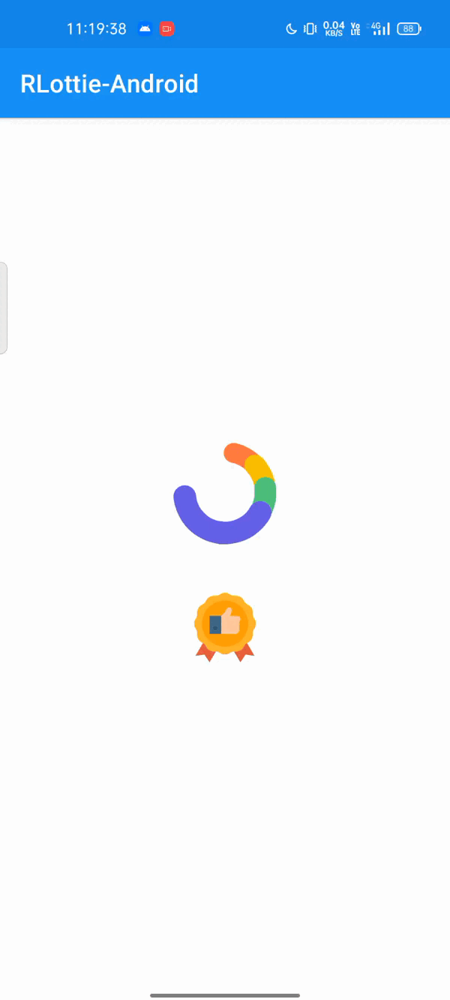

# RLottie-Android
[](https://github.com/RohitVermaOP/StackBlur)
[](https://jitpack.io/#RohitVermaOP/RLottie-Android)
[](./LICENSE)

rLottie animation player for Android

## Screenshot



## Download 

Add to project's build.gradle
```gradle
allprojects {
	repositories {
		maven { url 'https://jitpack.io' }
	}
}
```

Add to module-level build.gradle
```gradle
dependencies { 
    implementation 'com.github.RohitVermaOP:RLottie-Android:<latest-version>'
}
```

## Usage

Lottie#init :- Add to application or activity onCreate
```java
Rlottie.init(this);
```

## Developer

Developed by ```Rohit Verma```
+ [Instagram](http://instagram.com/mr_rohitverma88)
+ [Telegram](http://t.me/RohitVerma88)

## Special Thanks
+ [Telegram](https://github.com/DrKLO/Telegram)
+ [rlottie](https://github.com/Samsung/rlottie)
+ [loader_desygner](https://lottiefiles.com/93759-loader-desygner) and [top_badge](https://lottiefiles.com/96489-top-badge-animation) animation from [LottieFiles](https://lottiefiles.com)
